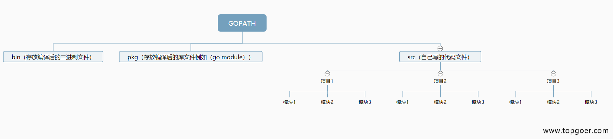
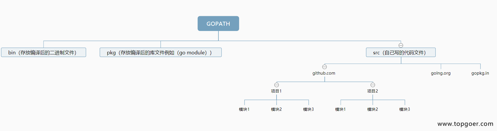
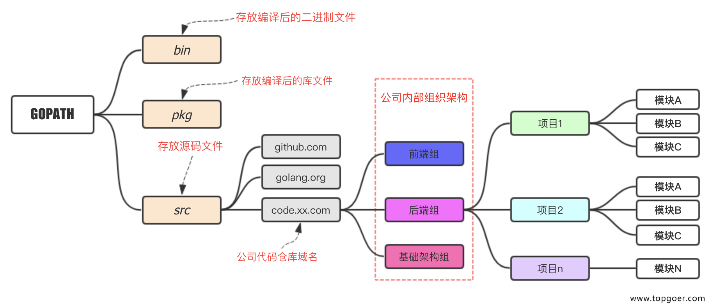

1. go 语言核心概念

+ 包声明

+ 引入包

+ 函数

+ 变量

+ 语句&表达式

+ 注释

2. 后缀名 .go

3. main 函数是每一个可执行程序所必须包含的, 且必须在main 包里面

4. 注释

   以 // 开头的单行注释。多行注释也叫块注释，均已以 /* 开头，并以 */ 结尾，且不可以嵌套使用，多行注释一般用于包的文档描述或注释成块的代码片段

5. 执行go程序

   go run main.go

6. 分号不是必须的，与rust 不同，rust 分号是必须的。

   在go 语言中使用行分割符，在 Go 程序中，一行代表一个语句结束，
   如果你打算将多个语句写在同一行，它们则必须使用 ; 人为区分

7. go 语言与其他语言不同的地方

   > 声明了变量而未使用会报错

         func main(){
            a:=12
            //./string.go:115:2: a declared but not used
         }

   >1. 多重赋值

         x,y=10,12
   >2. 函数可以返回多个值

         func test(s string) (int,error){
            return strconv.ParseInt(s,10,0)
         } 

         func Names() (string, string) {
            return "Foo", "Bar"
         }

         n1,n2:=Names() // n1=Foo, n2=Bar
   
   > 3. 匿名变量_(下划线)

      因为go 语言要求变量声明了必须使用，但是go语言中函数可以返回多个值，有时候我们只想使用其中一个值，这时候可以使用匿名变量跳过某个值

            n3, _ := Names() //Gets first return value and skips second
            fmt.Println(n3)
   
   >4. 函数命名返回值

         func Names() (first string, second string) { //Returned values have names.
            first = "Foo"   //Values assigned to named return variables
            second = "Bar"   //Values assigned to named return variables
            return
         }
   
   >5. 标准库

   引入了未使用的库也会报错

         import "fmt"
         import "strconv"

         import (
            "fmt"
            "strconv"
            "encoding/json"
         )

         func main(){
            a:="12"
            b,_:=strconv.ParseInt(a,10,64)
            fmt.Println(b)
         }

         ./string.go:5:2: imported and not used: "encoding/json"

6. go 工作区

   gopath: 工作区是一个包含src、pkg和bin目录的目录层次结构

   goroot： 是go 语言的安装目录，

   + 个人目录

   

   + 最流行的

   

   + 企业

   

