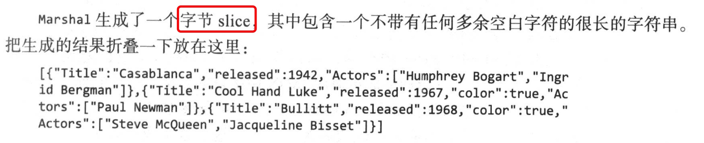
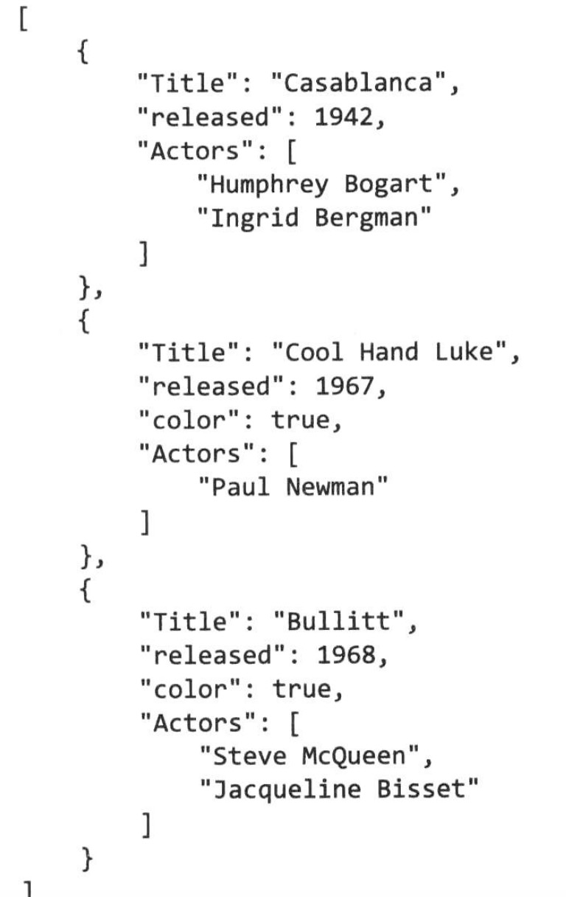
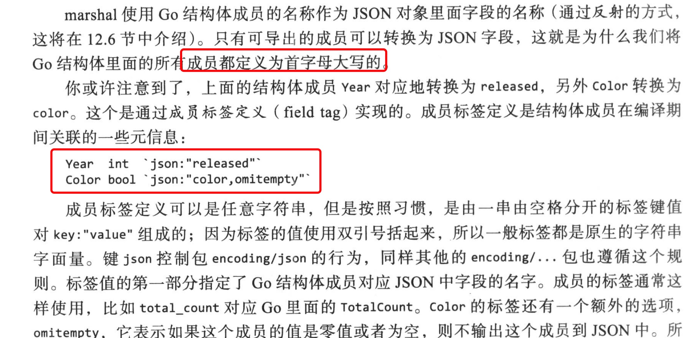
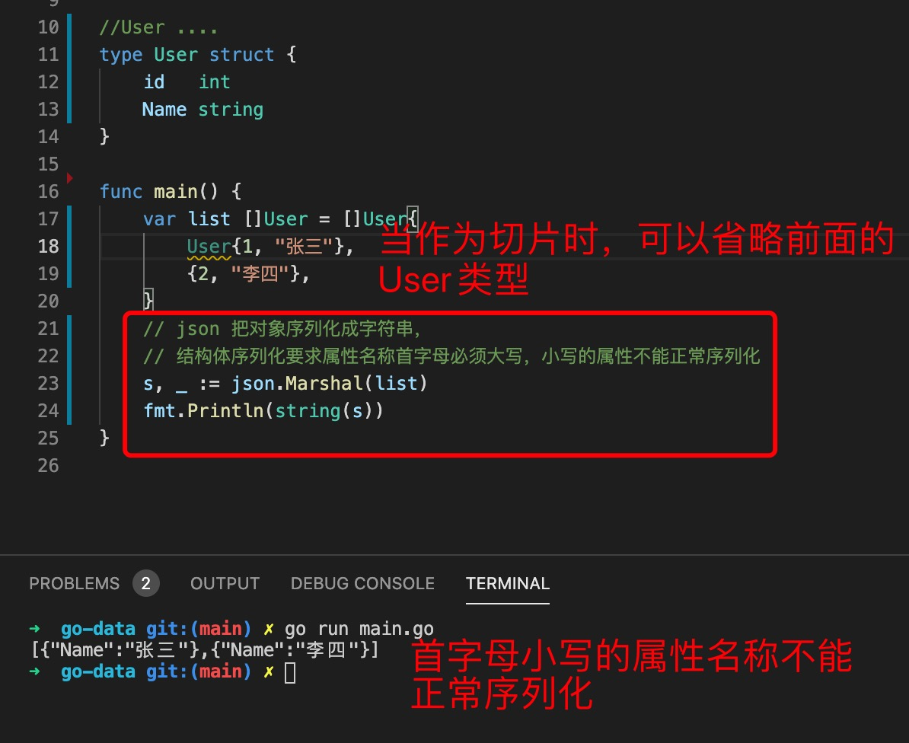
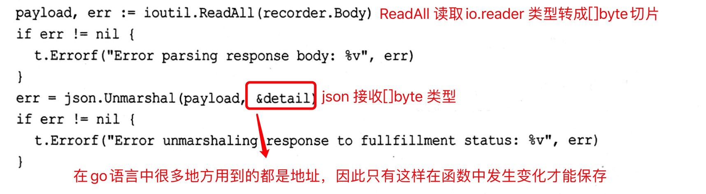

1. json 编码和解密

        package main

        import (
            "encoding/json"
            "fmt"
        )

        type Result struct {
            // 属性名称首字母大写，小写的不能正常序列化
            Code    int    `json:"code"` // 对应的json 的值
            Message string `json:"msg"`  // 对应的json 的值
        }

        func main() {
            var res Result
            res.Code = 200
            res.Message = "success"

            //序列化
            jsons, errs := json.Marshal(res)
            if errs != nil {
                fmt.Println("json marshal error:", errs)
            }
            fmt.Println("json data :", string(jsons))
            //  {"code":200,"msg":"success"}

            // 如果没有json:"code" ，那么应该为
            // {"Code":200,"Message":"success"}

            //反序列化
            var res2 Result
            errs = json.Unmarshal(jsons, &res2)
            if errs != nil {
                fmt.Println("json unmarshal error:", errs)
            }
            fmt.Println("res2 :", res2)
            fmt.Println(res2.Code)
        }

2. MarshalIndent : 是会格式化输出

   Marshal: 

   

   MarshalIndent:

   

3. json 

   

4. json 解析结构体

   
   