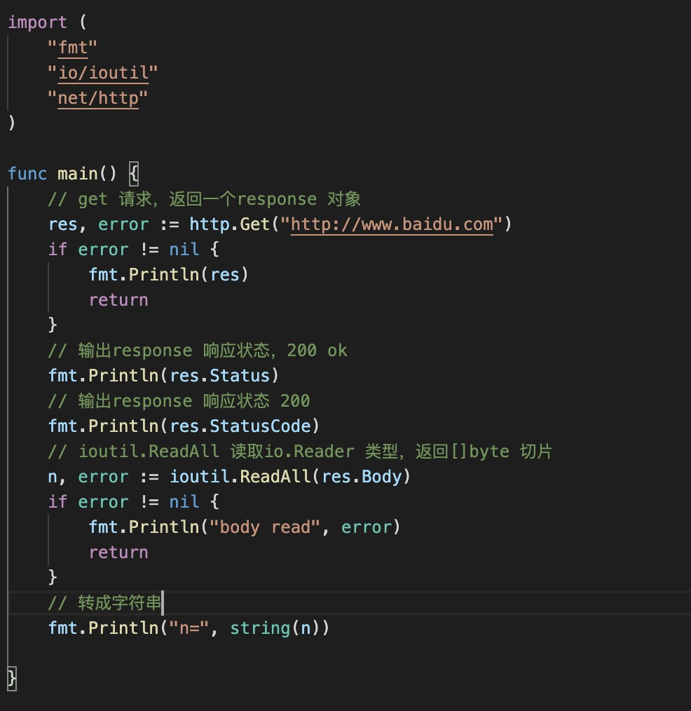

1. ReadAll: 接受一个io.reader 类型，返回[]byte 切片

        func ReadAll(r io.Reader) ([]byte, error)

   ReadAll从r读取数据直到EOF或遇到error，返回读取的数据和遇到的错误。成功的调用返回的err为nil而非EOF。因为本函数定义为读取r直到EOF，它不会将读取返回的EOF视为应报告的错误

   

2. ReadFile :读取文本内容

        func ReadFile(filename string) ([]byte, error)
    
    

3. WriteFile: 在文件中写入内容，如果文件不存在则按照给出的权限创建文件，否则则写入的数据之前情况文件

   

4. ReadDir: 

        func ReadDir(dirname string) ([]os.FileInfo, error)

        返回dirname指定的目录的目录信息的有序列表。