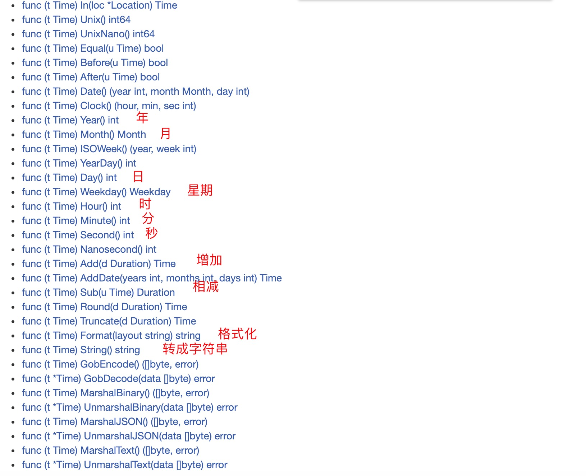

1. Now 获取当前时间

        time.Now() //2021-03-10 17:50:18.617211 +0800 CST m=+0.000177367

2. Utc 返回零时区

        time.Now().Utc() // 零时起，北京时区为+8 

        2021-03-10 09:52:12.675481 +0000 UTC

3. Unix 返回毫秒数
   
   Unix将t表示为Unix时间，即从时间点January 1, 1970 UTC到时间点t所经过的时间（单位秒）

        time.Now().Unix() //1615369981 和js 相比差1000倍

4. UnixNano纳秒

   UnixNano将t表示为Unix时间，即从时间点January 1, 1970 UTC到时间点t所经过的时间（单位纳秒）

        time.Now().UnixNano()//1615370280971611000

5. Time 结构体

   

6. 时间格式化

        fmt.Println(now.Format("2006-01-02 15:04:05"))

   > 注意事项：用now.Format()方式 其字符串的格式是特定的"2006-01-02 15:04:05",我们在使用的时候可以根据需求对其更改，例如只显示年月日，以及时间的间隔符号等。