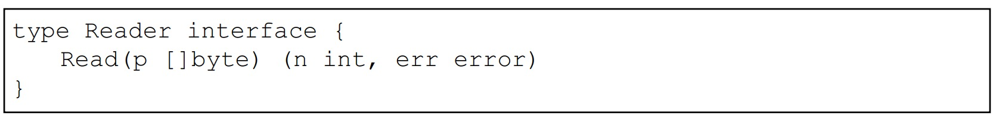
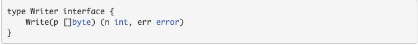
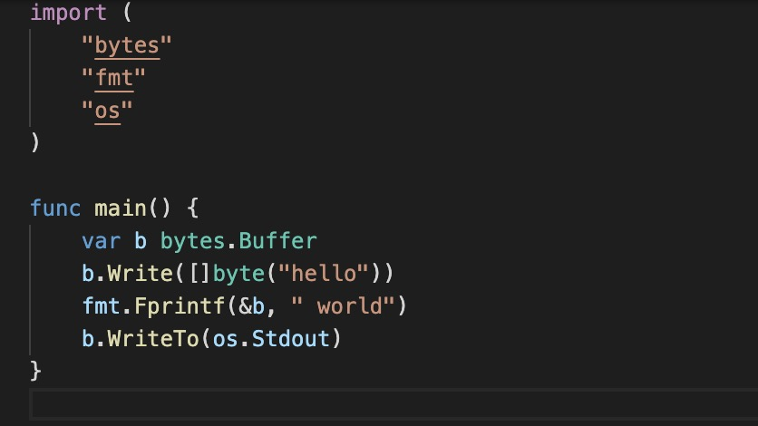
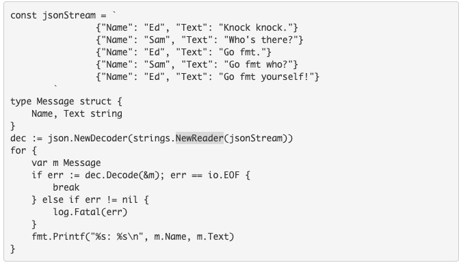

1. io 包是围绕实现了io.Writer 和 io.Rreader 接口类型的值而构建的

2. reader

   

3. Writer

    

   比如 bytes.Buffer 实现了write

   

4. bytes.Buffer 实现了io.writer 和 io.reader 

5. strings.NewReader 实现了io.Reader

   

6. Copy:将src的数据拷贝到dst，直到在src上到达EOF或发生错误。返回拷贝的字节数和遇到的第一个错误。

      func Copy(dst Writer, src Reader) (written int64, err error)

